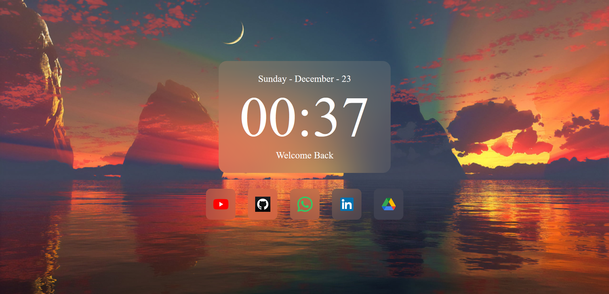

# NewTab Page Project

Welcome to the NewTab Page project! This project provides a customizable and visually appealing new tab page for your web browser, implemented using HTML, CSS, and JavaScript.

## Table of Contents
- [Demo](#demo)
- [Features](#features)
- [Future Features](#future-features)
- [Getting Started](#getting-started)
- [Customization](#customization)
- [Recommended Projects](#recommended-projects)
- [Preview](#preview)

## Demo
[Live Demo](https://mleandr0.github.io/)

## Features

- **Sleek Design**: Enjoy a minimalist design for your new tab page.
- **Quick Links**: Easily access your favorite websites with up to 5 customizable quick links.
- **Time and Date**: Stay informed with a clock and date display.

## Future Features
- **Custom Background**: Add an option to set a custom background image or color to personalize your experience.
- **Choose Between Dates or Weather**: Add an option to choose between displaying date or your local weather.
- **Improved Welcome Messages**: Set different messages depending on the day or hour.

## Getting Started

To use this new tab page you can just set the demo page as your new tab on your browser using its own configuration or some extension, but if you want to change background or something else, follow these steps:

1. Clone the repository:
    ```bash
    git clone git@github.com:MLeandr0/mleandr0.github.io.git
    ```

2. Open `index.html` in your web browser.

3. At last, enjoy your new tab page!

## Customization

### Background

You can customize the background by:

- Changing the background image in the `style` folder.

### Favorites

On desktop, you can modify the quick links just by:

- Hovering the mouse over any quick link and clicking on the three dots.
- After that add the full link to the page you want to add and click on the save button.

## Recommended Projects

Check out this projects that inspired this NewTab Page:

- [Nightly](https://github.com/damnitharshit/nightly)

## Preview
<p align="center">

</p>


